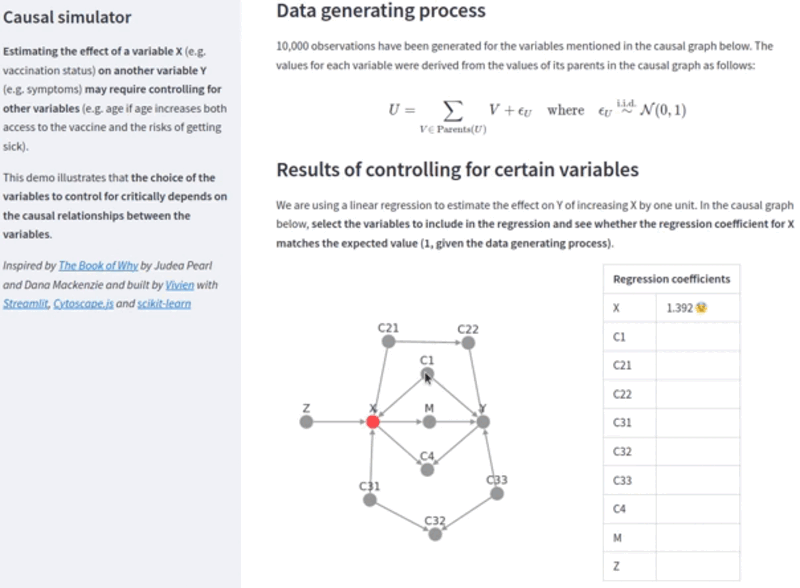

# Causal simulator

Interactive demo to illustrate the back-door criterion (cf. the *[Book of Why](http://bayes.cs.ucla.edu/WHY/)* by Judea Pearl and Dana Mackenzie)



## Live version

[Try it now!](https://share.streamlit.io/vivien0000/causal-simulator/main/app.py)

## Local installation and run

```bash
pip install -r requirements.txt
streamlit run app.py
```